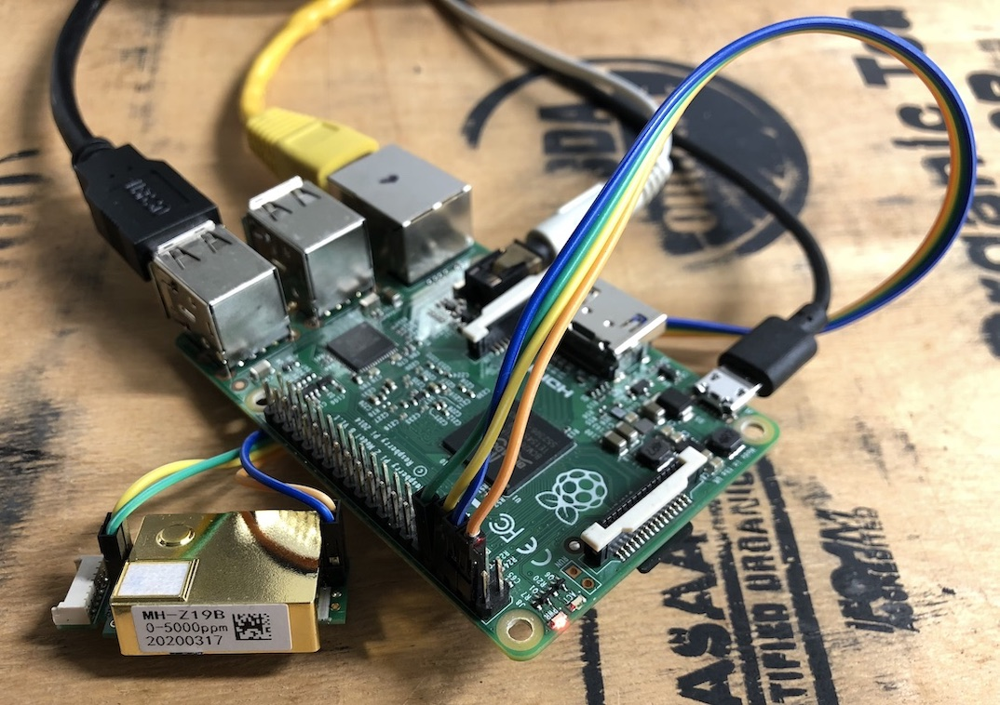

# co2data_logger

Script for handling Carbon Dioxide CO2 data measured with MH-Z19 sensor connected to Raspberry Pi GPIO header.

## Features

- shell output
- .csv data logging
- three level audible alert
- measuring intervals for day/night
- data graph accessible on local network via browser

## Reference

https://github.com/UedaTakeyuki/mh-z19

